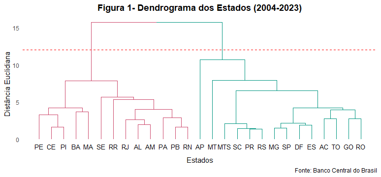
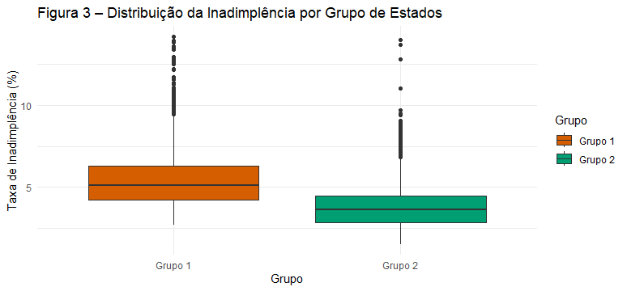

# 🔍 Análise de Cluster da Inadimplência por Estado no Brasil (2004–2023)

Este projeto realiza uma análise de cluster hierárquico para identificar padrões de inadimplência entre os estados brasileiros ao longo do tempo. Utilizando dados do Banco Central do Brasil, o objetivo é agrupar Unidades Federativas com comportamentos semelhantes em relação à taxa de inadimplência de crédito para pessoas físicas.

---

## 🎯 Objetivo

Agrupar os 26 estados brasileiros e o Distrito Federal com base em seus perfis históricos de inadimplência, identificando padrões regionais e comportamentos semelhantes ao longo de um período de 20 anos (2004–2023).

---

## 📁 Estrutura do Projeto

```
inadimplencia-cluster-brasil/
├── data/         # Base de dados utilizada
├── figures/      # Gráficos gerados (dendrograma, boxplots, séries temporais)
├── scripts/      # Script em R com toda a análise
└── README.md     # Explicação do projeto, metodologia e resultados
```

---

## 🧠 Metodologia

- **Linguagem**: R  
- **Principais pacotes**: `tidyverse`, `lubridate`, `ggplot2`, `dendextend`, `ggrepel`

### 🔎 Etapas:
- Transformação e agregação da base
- Cálculo de medidas descritivas
- Análise de cluster hierárquico com linkage completo
- Visualização com dendrogramas e boxplots
- Comparação dos grupos com eventos macroeconômicos

---

## 📊 Exemplos de Resultados

### 📌 Dendrograma de Clusters



### 📌 Boxplot da Inadimplência por Grupo



---

## ⚙️ Como Reproduzir

1. Clone o repositório:
```bash
git clone https://github.com/Jeff-Delavusca/inadimplencia-cluster-brasil.git
```
2. Abra o arquivo `scripts/analise_inadimplencia.R` no RStudio
3. Execute o script com os pacotes necessários instalados

---

## 👤 Autor

**Jeferson Delavusca Gonçalves**  
📍 Economista | Cientista de Dados em formação  
🔗 [LinkedIn](https://www.linkedin.com/in/jefersondelavusca)  
📁 [Portfólio GitHub](https://github.com/Jeff-Delavusca)

---

## ⚠️ Licença

Este projeto está licenciado sob a [MIT License](LICENSE) – fique à vontade para usar, adaptar e compartilhar.
